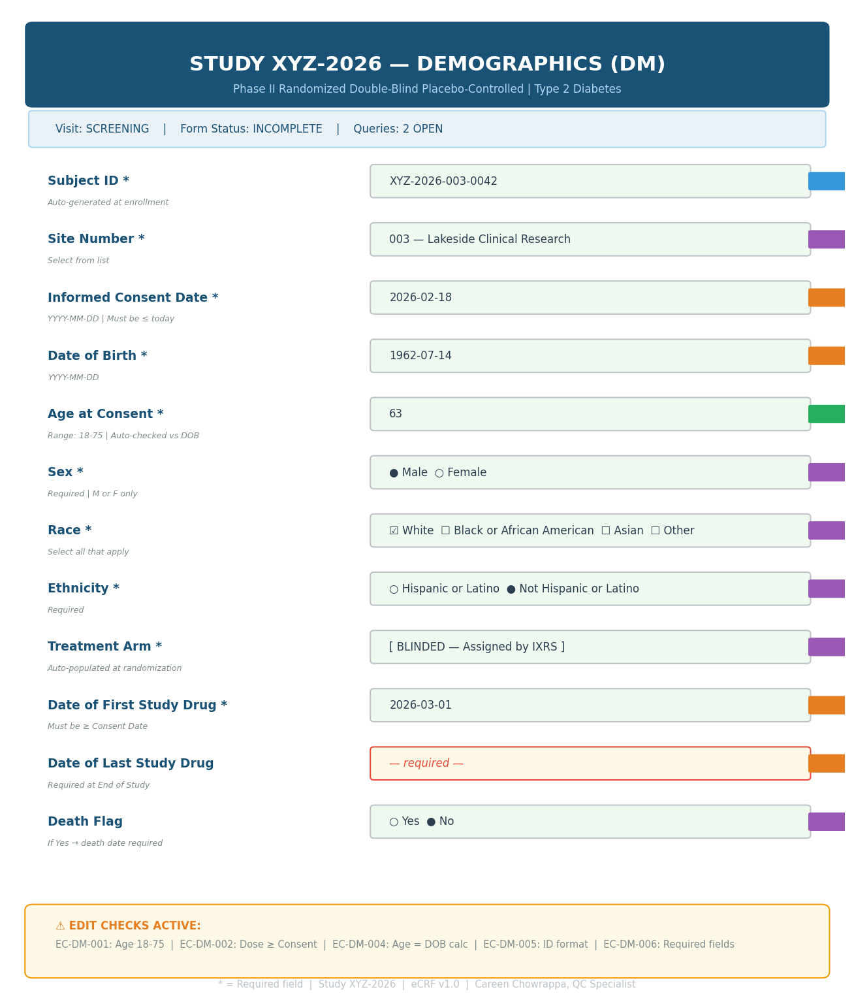
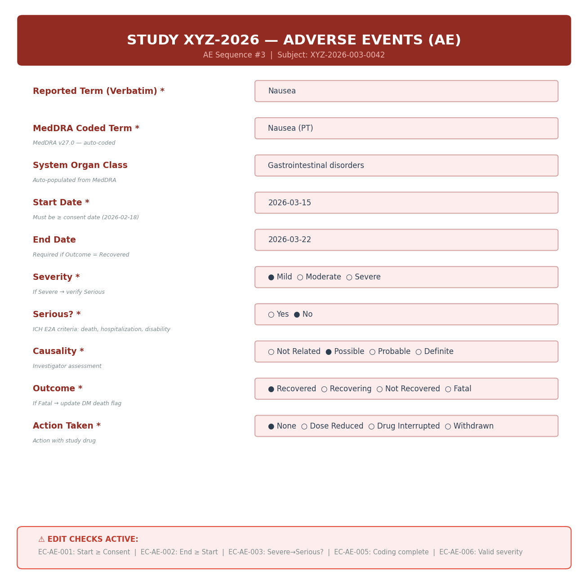
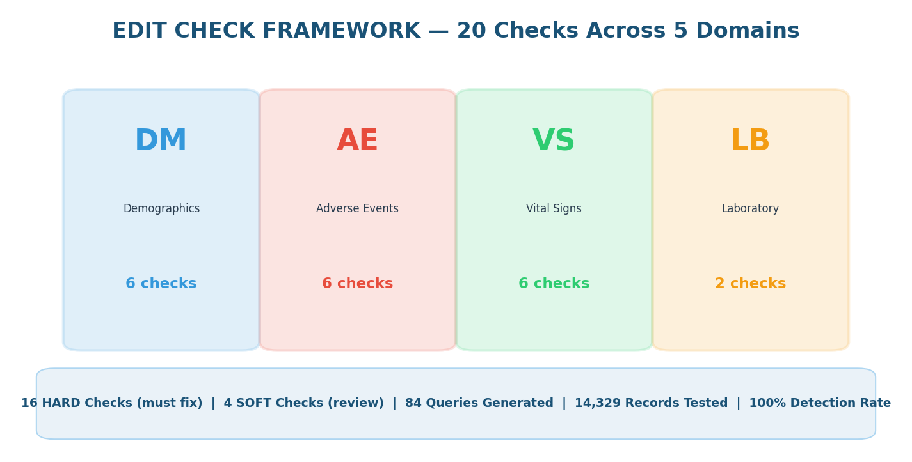
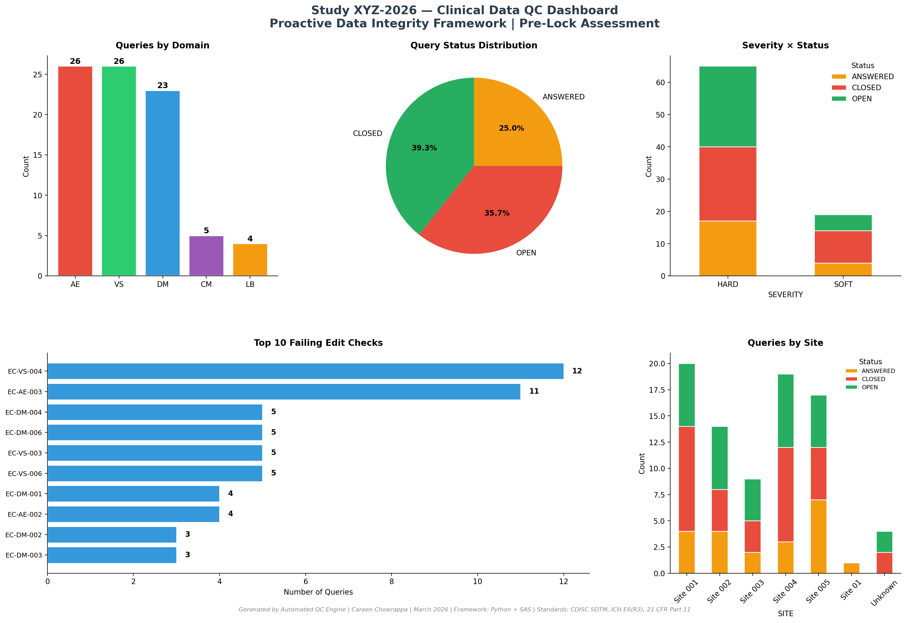
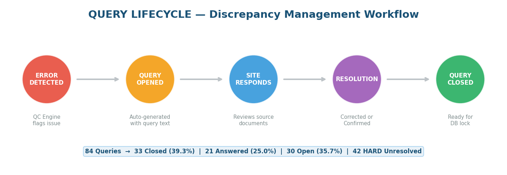
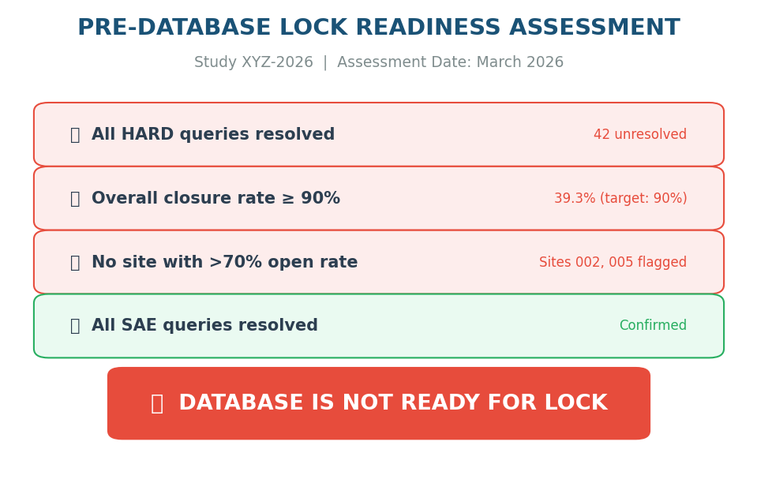

# 🏥 Proactive Clinical Data Integrity Framework
### Automated Edit Check & QC System for Clinical Trial EDC


---

## 🔍 The Problem

Between 2016–2023, the FDA issued **1,766+ warning letters** citing data integrity violations in pharmaceutical operations.

**In November 2024**, Applied Therapeutics received an FDA Warning Letter after a BIMO inspection found:
- ❌ Dosing errors across **19 patients** went unreported
- ❌ A third-party vendor **deleted electronic records** for all 47 trial participants
- ❌ The company reported **protocol doses instead of actual doses**

**Result:** Entire NDA rejected. Shareholders sued. Leadership replaced.

> The FDA and EMA are now shifting to **technology-focused inspections** in 2026 evaluating whether clinical trial systems **prevent** data integrity failures, not just document them after the fact.

**This project builds the solution.**

---

## 💡 The Solution

A **complete EDC Configuration & QC framework** for a simulated Phase II diabetes clinical trial (Study XYZ-2026, 200 subjects, 5 sites) that demonstrates the full lifecycle a Configuration & QC Specialist manages at a CRO:

| # | Deliverable | What It Proves |
|---|------------|----------------|
| 1 | eCRF Configuration (55 fields, 5 domains) | I can design clinical trial databases |
| 2 | Edit Check Specifications (20 checks) | I can write validation rules with regulatory references |
| 3 | Automated QC Engine | I can build systems that catch data integrity issues |
| 4 | Query Management Simulation | I understand the full discrepancy lifecycle |
| 5 | Pre-Lock Readiness Assessment | I can determine if a database is ready for regulatory submission |
| 6 | QC Dashboard | I can communicate findings visually to study teams |
| 7 | SAS Cross-Validation | I can work in both Python and SAS |
| 8 | End-User Training Guide | I can train site coordinators on data entry |

---

## 📊 Key Results

```
📁 Total records tested:       14,329 across 5 SDTM domains
🎯 Total errors planted:       61 across 15 FDA-cited violation categories
🔍 Total queries generated:    84 (65 HARD | 19 SOFT)
✅ Detection rate:             100% — every planted error caught
⚠️  Problem sites identified:  2 (Sites 002, 005 — >70% open query rate)
❌ Pre-lock verdict:           NOT READY — 42 HARD queries unresolved
🔄 Cross-validation:          Python vs SAS — 100% consistency
```

---

## 🖥️ eCRF Design — Demographics Form

The Configuration Specialist designs these forms before any patient data is entered. Each field has data type, validation rules, coded lists, and SDTM mapping.



---

## 🖥️ eCRF Design — Adverse Events Form

Safety data is the most critical domain in any clinical trial. Every AE must be captured with severity, causality, and outcome — with edit checks preventing common entry errors.



---

## ✅ Edit Check Framework

20 programmatic edit checks covering range validation, date logic, cross-field consistency, clinical plausibility, and coding completeness — each mapped to FDA regulatory references.



| Check ID | Domain | Rule | Severity | Regulatory Reference |
|----------|--------|------|----------|---------------------|
| EC-DM-001 | DM | Age must be 18–75 (protocol criteria) | HARD | Protocol Section 5.1 |
| EC-DM-002 | DM | First dose ≥ consent date | HARD | ICH E6(R3) Section 4.8 |
| EC-DM-003 | DM | Sex must be M or F | HARD | CDISC Controlled Terminology |
| EC-DM-004 | DM | Reported age matches DOB calculation | HARD | Transcription check |
| EC-DM-005 | DM | Subject ID format validation | HARD | 21 CFR Part 11 |
| EC-DM-006 | DM | Required fields non-null | HARD | ICH E6(R3) Section 5.5 |
| EC-AE-001 | AE | AE start ≥ consent date | HARD | ICH E6(R3) Section 6.2 |
| EC-AE-002 | AE | AE end ≥ AE start | HARD | Temporal logic |
| EC-AE-003 | AE | SEVERE → verify if SERIOUS | SOFT | ICH E2A |
| EC-AE-004 | AE | RECOVERED → end date required | SOFT | Completeness |
| EC-AE-005 | AE | Verbatim → coded term required | SOFT | MedDRA coding |
| EC-AE-006 | AE | Valid severity coded value | HARD | CDISC CT |
| EC-VS-001 | VS | Systolic BP: 70–250 mmHg | HARD | Clinical plausibility |
| EC-VS-002 | VS | Diastolic BP: 40–150 mmHg | HARD | Clinical plausibility |
| EC-VS-003 | VS | Systolic > Diastolic | HARD | Physiological logic |
| EC-VS-004 | VS | Heart rate: 40–180 bpm | HARD | Clinical plausibility |
| EC-VS-005 | VS | Temperature: 35.0–40.0°C | HARD | Clinical plausibility |
| EC-VS-006 | VS | Required vitals at each visit | HARD | Protocol Section 8.2 |
| EC-LB-001 | LB | HbA1c: 3.0–20.0% | HARD | Testable range |
| EC-LB-002 | LB | ALT > 3x ULN → hepatotoxicity | SOFT | FDA Hy's Law Guidance |

---

## 📈 QC Dashboard

The 5-panel dashboard a Data Manager reviews before recommending database lock:



---

## 🔄 Query Lifecycle

Every discrepancy follows a structured workflow from detection to resolution — this is the daily work of a QC Specialist at a CRO:



---

## 🔒 Pre-Database Lock Readiness Assessment

The final gate before data goes to biostatistics for analysis and regulatory submission:



```
VERDICT: ❌ DATABASE IS NOT READY FOR LOCK

Failed Criteria:
  ❌ All HARD queries resolved — 42 unresolved
  ❌ Overall closure rate ≥ 90% — currently 39.3%
  ❌ No site with >70% open rate — Sites 002, 005 flagged
  ✅ All SAE queries resolved — confirmed

ACTION: Resolve outstanding queries before lock date
```

---

## 🧬 About the Data

This project uses **synthetic clinical data calibrated against published Phase II diabetes trial parameters** — not random numbers:

| Parameter | Value | Published Source |
|-----------|-------|----------------|
| Age | Mean 55.6 (SD 10.0) years | DUAL VII, Frontiers in Pharmacology 2022 |
| HbA1c | Mean 8.84% (SD 0.94) | DUAL VII, Frontiers in Pharmacology 2022 |
| BMI | Mean 29.68 (SD 4.79) kg/m² | DUAL VII, Frontiers in Pharmacology 2022 |
| Systolic BP | Mean 132 (SD 14) mmHg | SURPASS-2, NEJM 2021 |
| AE Rate | ~1.8 AEs/subject | Typical Phase II diabetes trial |
| Concomitant Meds | ~3.2 meds/patient | T2D comorbidity profile |

> **Why synthetic?** This project simulates the work of a **Configuration & QC Specialist** — the role that designs the database and validates it *before* real patient data is entered. In production, this is called **User Acceptance Testing (UAT)**: you generate test data with known errors to verify edit checks fire correctly. Using a pre-existing dataset would miss the entire point of EDC configuration work.

---

## 📁 Project Structure

```
clinical-edc-qc-framework/
│
├── 📄 README.md
├── 📄 requirements.txt
├── 📄 .gitignore
│
├── 📂 docs/
│   ├── 01_eCRF_configuration_spec.xlsx      ← 55 fields across 5 SDTM domains
│   ├── 02_edit_check_specs.xlsx             ← 20 checks with regulatory references
│   ├── 04_data_entry_guide.md               ← Site coordinator training guide
│   └── 05_validation_summary.md             ← UAT validation report
│
├── 📂 data/
│   ├── dm_test_data.csv                     ← 200 subjects (Demographics)
│   ├── ae_test_data.csv                     ← 337 records (Adverse Events)
│   ├── vs_test_data.csv                     ← 1,200 records (Vital Signs)
│   ├── lb_test_data.csv                     ← 12,000 records (Laboratory)
│   └── cm_test_data.csv                     ← 592 records (Concomitant Meds)
│
├── 📂 python/
│   ├── 00_build_ecrf_specs.py               ← eCRF specification generator
│   ├── 00b_build_edit_checks.py             ← Edit check specification generator
│   ├── 01_generate_test_data.py             ← Synthetic data with 61 planted errors
│   ├── 02_qc_engine.py                      ← Automated QC engine (20 checks)
│   ├── 03_query_management.py               ← Query lifecycle simulation
│   ├── 04_qc_dashboard.py                   ← 5-panel visual dashboard
│   └── 05_generate_screenshots.py           ← eCRF mockups and infographics
│
├── 📂 sas/
│   └── 01_qc_cross_validation.sas           ← Independent SAS validation
│
├── 📂 outputs/
│   ├── discrepancy_database.csv             ← 84 queries with full metadata
│   ├── qc_summary_report.csv                ← Aggregated QC metrics
│   ├── site_query_summary.csv               ← Site-level query analysis
│   ├── lock_readiness_report.txt            ← Pre-lock pass/fail assessment
│   └── qc_dashboard.png                     ← 5-panel visual dashboard
│
└── 📂 screenshots/
    ├── demographics_ecrf.png                ← DM form mockup
    ├── adverse_events_ecrf.png              ← AE form mockup
    ├── edit_check_summary.png               ← Edit check infographic
    ├── query_lifecycle.png                  ← Query workflow diagram
    └── lock_readiness.png                   ← Pre-lock assessment visual
```

---

## 🚀 How to Run

```bash
# Clone the repository
git clone https://github.com/careenc16/clinical-edc-qc-framework.git
cd clinical-edc-qc-framework

# Create virtual environment
python -m venv venv
source venv/bin/activate        # Mac/Linux
# venv\Scripts\activate         # Windows

# Install dependencies
pip install -r requirements.txt

# Run the full pipeline in order
python python/00_build_ecrf_specs.py         # Step 1: Generate eCRF specifications
python python/00b_build_edit_checks.py       # Step 2: Generate edit check specs
python python/01_generate_test_data.py       # Step 3: Generate synthetic test data
python python/02_qc_engine.py                # Step 4: Run all 20 QC checks
python python/03_query_management.py         # Step 5: Simulate query lifecycle
python python/04_qc_dashboard.py             # Step 6: Generate QC dashboard
python python/05_generate_screenshots.py     # Step 7: Generate eCRF mockups

# SAS cross-validation (requires SAS OnDemand for Academics — free)
# Upload data/ CSVs to SAS OnDemand and run sas/01_qc_cross_validation.sas
```

---

## 🛠️ Tools & Standards

| Category | Details |
|----------|---------|
| **Languages** | Python 3.11, SAS 9.4 |
| **Python Libraries** | pandas, numpy, matplotlib, seaborn, openpyxl, scipy |
| **SAS Procedures** | PROC SQL, PROC MEANS, PROC FREQ, PROC PRINT, DATA step, PRXMATCH |
| **Data Standards** | CDISC SDTM, CDISC CDASH, ICH E6(R3) GCP |
| **Regulatory** | 21 CFR Part 11, FDA BIMO Compliance, ICH E2A (Safety Reporting) |
| **Principles** | ALCOA+ (Attributable, Legible, Contemporaneous, Original, Accurate) |
| **Concepts** | EDC configuration, eCRF design, edit checks, query management, UAT, database lock, MedDRA coding |

---

## 👤 Author

**Careen Chowrappa**
MS in Data Science | Clinical Data Analytics & EDC Configuration

[](https://www.linkedin.com/in/careen-c-961018195/)
[](https://github.com/careenc16)

> This project was built to address real FDA BIMO data integrity findings through a proactive, automated approach to clinical data quality.

---

*Built March 2026 | Addressing FDA data integrity violations through proactive QC*
*Standards: CDISC SDTM | ICH E6(R3) | 21 CFR Part 11 | ALCOA+*
